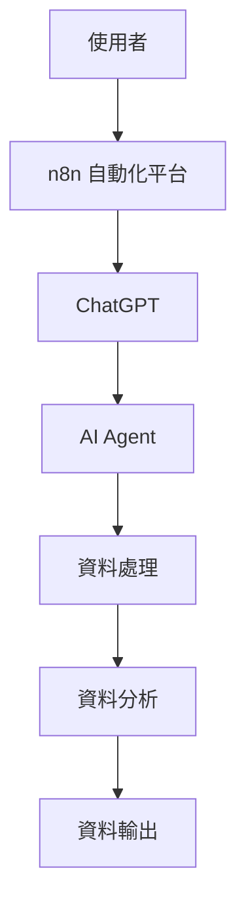

# AI Agent Implementaion

## Problem Translation

| 項目            | 說明                                                                 |
|-----------------|----------------------------------------------------------------------|
| 商業目標        | 減少人工客服工時、提升訊息處理效率與一致性、實現知識庫即時回答         |
| 使用情境        | LINE／表單／網站來訊，包含商品諮詢、客訴分類、退貨流程查詢等             |
| 客戶訊息類型    | 商品問題、使用教學、售後服務、抱怨、建議、常見問答、無意圖雜訊             |
| 初步目標功能    | 自動分類訊息意圖並回覆標準答案，無法處理則轉接人類；互動內容紀錄並入庫分析  |
| 使用者回饋      | 可記錄是否解決問題、是否需轉人工、是否滿意                                 |

## Solution
實作ChatGPT(4o)為核心的AI Agent，並整合至n8n自動化平台中

## Architecture

## Implementation

整合 OpenAI API 與內部資料（如知識庫、SOP）建立 contextual 回應
---

## LLM integration / prompt engineering

---

## RAG(Retrieval-Augmented Generation)
> 讓AI Agent可查詢內部 FAQ、SOP、產品資料

---

## Webhook API
